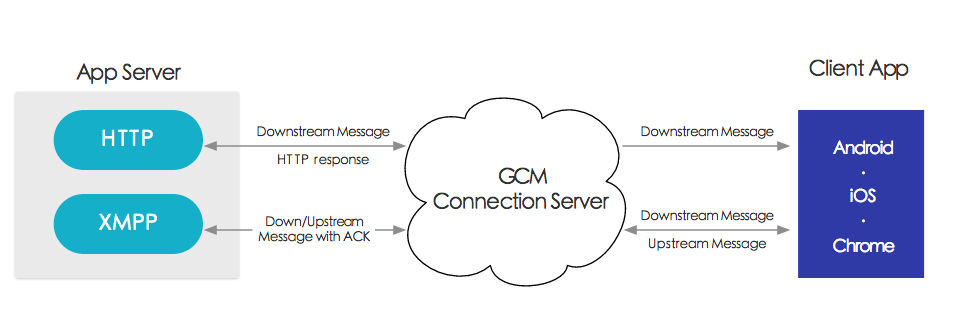

# 名词介绍

**GCM**

全称[Google Cloud Messaging](https://developers.google.com/cloud-messaging/)，是Google向开发者提供消息推送能力的服务

####  

**FCM**

全称[Firebase Cloud Messaging](http://firebase.google.com/docs/cloud-messaging/)，是新一代的GCM，继承了GCM的所有能力，归属于Firebase的功能

> FCM 提供两种方式为chrome提供消息推送服务
>
> - **Chrome 中的网站**可以通过符合网络推送标准的服务工作线程和网络应用清单实现[推送消息传递](https://developers.google.com/web/fundamentals/getting-started/push-notifications/?hl=cn)。
> - **Chrome 应用和扩展程序**可以直接通过 [chrome.gcm](https://developer.chrome.com/apps/gcm) API 访问FCM服务。
>
>
>
> chrome网站集成推送服务，暂时只能回到GCM的集成方式

**service worker**

Service worker是独立于页面的一个运行环境，它在页面关闭后仍可以运行。同时，也能对它负责的页面的网络请求进行截取和返回请求

但是目前兼容性很差，只有少量chrome、firefox、opera支持

# DEMO

支持消息推送的web app教程：https://developers.google.com/web/fundamentals/getting-started/push-notifications/?hl=zh-cn

直接运行的Demo：https://github.com/gauntface/simple-push-demo

> 需要在翻墙状态下访问，不然无法向GCM注册服务

# Remark

在Mac上启动`chrome://flags/#enable-native-notifications`选项后，仅支持在OS X中的通知中心显示推送内容，不能在完全关闭chrome的场景下接收推送内容（Safari 的推送可以在完全关闭的情况继续接收推送）